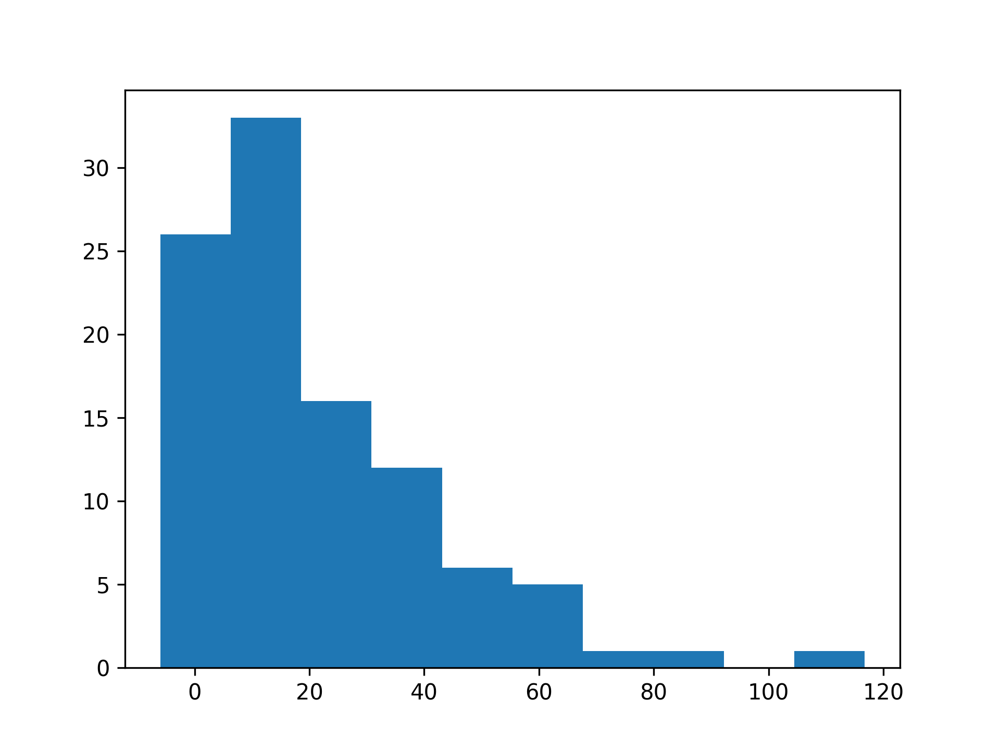

# Summary

Mean: 11.45, StDev: 22.33

ID|Performance|Invest|Benefit|Buy|Sell
---|---|---|---|---|---
[1402](1402/)|-14.22|183.09|-2604|42|37
[3037](3037/)|-13.86|266.65|-3696|10|10
[3189](3189/)|-13.38|413.21|-5529|19|19
[2383](2383/)|-10.94|1025.98|-11224|30|27
[4919](4919/)|-10.0|240.18|-2402|25|25
[2368](2368/)|-8.8|366.0|-3221|19|19
[3019](3019/)|-8.76|852.17|-7465|41|39
[4938](4938/)|-8.2|264.81|-2171|18|18
[3008](3008/)|-7.97|15125.08|-120547|25|21
[2458](2458/)|-7.86|693.38|-5450|20|20
[3044](3044/)|-6.65|751.21|-4996|27|27
[2912](2912/)|-6.32|1659.84|-10490|31|31
[2231](2231/)|-6.06|615.18|-3728|10|10
[1707](1707/)|-5.93|1584.87|-9398|45|39
[6505](6505/)|-5.24|1204.92|-6314|39|37
[2014](2014/)|-5.1|41.96|-214|27|25
[2371](2371/)|-4.74|151.19|-717|10|10
[2337](2337/)|-4.55|352.83|-1605|29|29
[5269](5269/)|-4.41|4030.4|-17774|10|10
[4927](4927/)|-4.29|868.46|-3726|27|27
[1216](1216/)|-4.21|646.48|-2722|37|36
[1101](1101/)|-3.91|468.4|-1831|51|44
[2449](2449/)|-2.96|319.59|-946|29|26
[1326](1326/)|-2.86|1228.7|-3514|44|37
[6670](6670/)|-2.55|1749.19|-4460|36|33
[2884](2884/)|-1.99|142.63|-284|26|26
[2412](2412/)|-1.96|324.99|-637|18|17
[6456](6456/)|-1.62|739.03|-1197|27|23
[6278](6278/)|-1.45|833.82|-1209|17|17
[3714](3714/)|0|0|0|0|0
[3661](3661/)|0.19|2900.64|551|13|13
[2474](2474/)|0.72|3491.56|2514|42|42
[2633](2633/)|1.35|286.11|386|26|22
[1314](1314/)|2.07|74.49|154|44|43
[2002](2002/)|2.14|208.43|446|38|35
[1303](1303/)|2.16|1316.79|2844|43|40
[2395](2395/)|2.17|2326.13|5048|46|46
[2456](2456/)|2.48|1526.51|3786|31|31
[2049](2049/)|3.39|2305.46|7816|22|22
[5522](5522/)|3.44|341.31|1174|47|45
[2353](2353/)|3.6|244.75|881|35|29
[2881](2881/)|3.82|308.39|1178|39|39
[6669](6669/)|3.85|4439.08|17090|27|23
[2207](2207/)|4.1|3738.12|15326|21|20
[2301](2301/)|4.96|498.09|2471|46|46
[2354](2354/)|5.01|500.25|2506|45|45
[2328](2328/)|5.11|99.0|506|33|33
[8016](8016/)|5.16|1726.59|8909|42|42
[4961](4961/)|5.23|581.82|3043|26|26
[3014](3014/)|5.41|358.68|1940|27|27
[1909](1909/)|5.46|146.76|801|29|25
[3042](3042/)|5.54|491.12|2721|36|36
[3406](3406/)|6.0|7142.24|42853|26|26
[2308](2308/)|6.4|1480.68|9476|38|38
[2377](2377/)|6.4|799.0|5114|32|28
[2317](2317/)|6.51|1042.18|6785|46|46
[4576](4576/)|6.65|650.37|4325|20|20
[2642](2642/)|6.9|259.34|1789|32|29
[2357](2357/)|7.65|1764.84|13501|45|41
[2408](2408/)|8.0|557.66|4461|34|34
[3443](3443/)|8.06|1418.62|11434|18|18
[6271](6271/)|8.32|1001.6|8333|20|20
[2382](2382/)|9.64|1267.7|12221|45|41
[2409](2409/)|9.64|65.38|630|12|12
[2454](2454/)|9.78|8610.31|84209|28|28
[1513](1513/)|9.8|448.76|4398|23|21
[1301](1301/)|10.26|822.7|8441|32|28
[2345](2345/)|10.41|1002.05|10431|19|19
[2331](2331/)|10.74|82.6|887|22|21
[2344](2344/)|11.54|65.25|753|15|15
[1305](1305/)|11.77|177.08|2084|40|38
[6116](6116/)|11.95|45.45|543|22|22
[2481](2481/)|11.97|236.24|2828|16|16
[2330](2330/)|12.83|3350.1|42982|44|44
[1722](1722/)|12.9|546.28|7047|42|37
[2610](2610/)|13.48|89.39|1205|35|32
[3481](3481/)|14.3|61.74|883|17|17
[2492](2492/)|14.61|2168.34|31679|27|27
[5871](5871/)|15.67|1268.9|19884|36|35
[2379](2379/)|16.17|2105.37|34044|17|17
[2027](2027/)|18.9|233.39|4411|38|35
[2618](2618/)|21.19|113.62|2408|29|20
[6415](6415/)|21.41|4556.83|97562|7|7
[2006](2006/)|21.71|785.22|17047|54|52
[2376](2376/)|23.21|887.34|20595|42|42
[4968](4968/)|31.72|775.51|24599|9|9
[3006](3006/)|32.14|423.24|13603|32|32
[3034](3034/)|32.32|4171.45|134821|30|30
[2327](2327/)|35.13|4264.18|149801|23|23
[1907](1907/)|40.27|273.86|11028|42|40
[2603](2603/)|42.69|68.14|2909|20|20
[2609](2609/)|43.17|32.73|1413|10|10
[2038](2038/)|46.24|59.06|2731|26|26
[3711](3711/)|46.69|1102.0|51452|29|29
[2303](2303/)|49.64|105.8|5252|17|17
[6533](6533/)|49.98|1468.22|73382|12|12
[8046](8046/)|58.49|334.46|19563|6|6
[1309](1309/)|63.99|196.27|12559|24|24
[4976](4976/)|81.78|188.72|15434|15|14
[6531](6531/)|91.21|1681.63|153381|11|11
[3545](3545/)|119.89|358.56|42988|13|13
