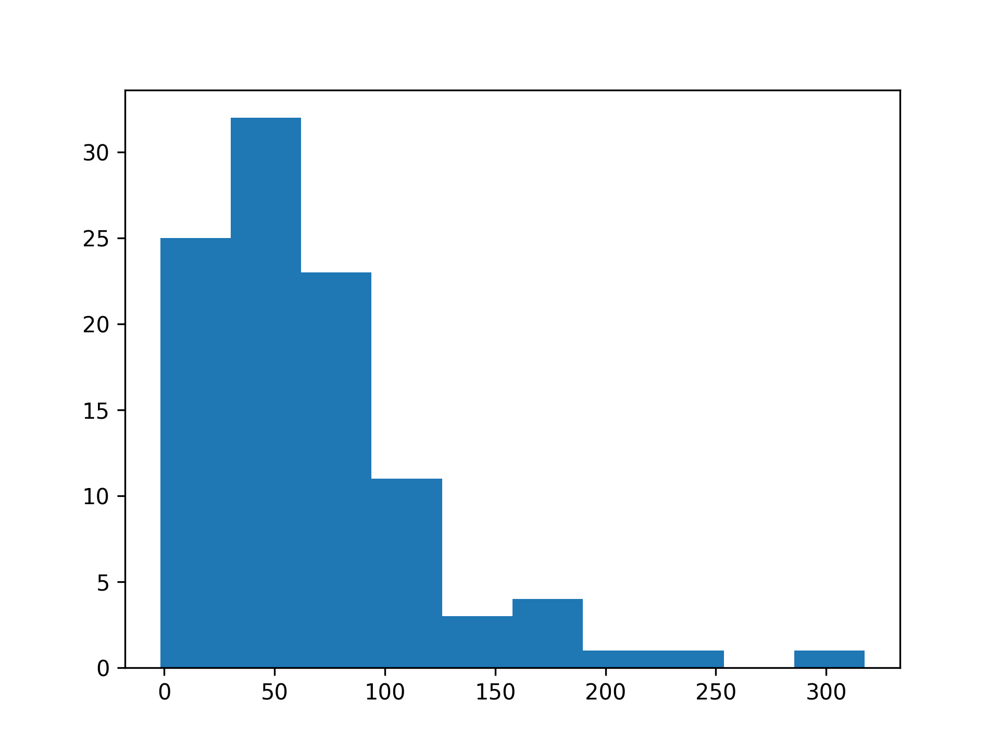

# Summary

Mean: 12.69, StDev: 19.69

ID|Performance|Invest|Benefit|Buy|Sell
---|---|---|---|---|---
[2633](2633/)|-17.64|189.78|-3348|6|6
[2912](2912/)|-11.42|2992.48|-34174|23|23
[2492](2492/)|-11.16|1157.19|-12914|16|15
[6278](6278/)|-10.49|1228.92|-12891|20|10
[4927](4927/)|-9.26|258.19|-2391|13|10
[2642](2642/)|-8.55|218.7|-1870|12|12
[2027](2027/)|-8.39|206.44|-1732|15|15
[3008](3008/)|-7.85|13028.04|-102270|6|6
[2345](2345/)|-7.57|1376.73|-10422|16|11
[3711](3711/)|-7.57|636.06|-4815|22|21
[2618](2618/)|-7.0|53.87|-377|13|12
[1101](1101/)|-6.47|479.92|-3105|15|15
[1216](1216/)|-5.4|1042.86|-5631|18|17
[2354](2354/)|-4.25|446.78|-1899|17|11
[2474](2474/)|-3.9|2266.9|-8841|15|15
[1314](1314/)|-3.67|75.17|-276|25|25
[4919](4919/)|-2.79|328.02|-915|22|22
[1402](1402/)|-2.7|251.53|-679|17|9
[3044](3044/)|-2.46|895.93|-2204|15|14
[6669](6669/)|-2.17|9853.76|-21383|17|12
[5522](5522/)|-2.08|312.67|-650|18|18
[1707](1707/)|-2.02|1082.12|-2186|6|6
[2327](2327/)|-2.0|3227.99|-6456|22|22
[6505](6505/)|-1.73|1264.27|-2187|17|17
[2884](2884/)|-1.63|163.65|-267|6|6
[2383](2383/)|-1.07|1136.88|-1216|25|20
[2412](2412/)|-0.87|785.68|-684|14|14
[3037](3037/)|-0.57|820.23|-468|30|29
[3714](3714/)|0|0|0|0|0
[3019](3019/)|0.16|718.08|115|22|21
[2207](2207/)|0.84|3472.53|2917|10|10
[1301](1301/)|0.88|774.36|681|20|19
[1722](1722/)|1.76|951.68|1675|18|0
[1326](1326/)|1.85|638.83|1182|14|13
[5269](5269/)|1.98|12654.57|25056|23|21
[4938](4938/)|3.41|578.38|1972|13|13
[6670](6670/)|3.87|1456.74|5638|15|10
[3189](3189/)|3.99|879.32|3508|30|26
[2382](2382/)|4.01|715.71|2870|25|19
[1303](1303/)|4.19|728.79|3054|12|11
[8046](8046/)|4.57|1287.03|5882|39|39
[2395](2395/)|5.38|2078.61|11183|15|15
[2357](2357/)|5.47|1992.6|10900|19|15
[2881](2881/)|6.55|690.79|4525|18|17
[2002](2002/)|6.75|230.21|1554|19|18
[2301](2301/)|7.14|481.66|3439|13|13
[2317](2317/)|7.18|1548.23|11116|25|24
[2379](2379/)|7.57|2252.71|17053|20|18
[2377](2377/)|8.62|2027.76|17479|31|31
[4961](4961/)|9.09|957.9|8707|35|30
[6271](6271/)|9.31|2679.45|24946|26|25
[8016](8016/)|9.37|1075.97|10082|20|17
[2449](2449/)|10.06|686.68|6908|21|20
[2006](2006/)|10.14|228.41|2316|15|15
[2231](2231/)|10.21|1515.59|15474|26|26
[4968](4968/)|11.2|4230.38|47380|28|20
[2376](2376/)|11.3|835.28|9439|34|34
[6456](6456/)|11.32|1029.36|11652|24|22
[3481](3481/)|11.78|163.36|1924|33|22
[1305](1305/)|11.83|177.32|2098|24|18
[6116](6116/)|12.09|217.82|2633|35|16
[3406](3406/)|12.15|7603.62|92384|18|15
[3014](3014/)|13.02|388.88|5063|21|20
[2371](2371/)|13.29|222.04|2951|11|2
[3034](3034/)|13.42|1555.83|20879|18|18
[2409](2409/)|13.75|221.71|3049|42|33
[4576](4576/)|13.85|1289.02|17853|34|31
[1909](1909/)|14.05|161.84|2274|27|20
[1309](1309/)|14.15|315.48|4464|43|42
[2456](2456/)|14.19|1094.09|15525|16|16
[2344](2344/)|14.78|201.8|2983|22|19
[5871](5871/)|15.09|1580.84|23855|20|18
[2049](2049/)|15.18|2743.11|41640|19|19
[2610](2610/)|15.84|61.13|968|20|18
[2353](2353/)|16.96|108.17|1835|28|24
[2337](2337/)|17.85|524.19|9357|23|16
[3006](3006/)|19.0|693.35|13174|31|28
[3042](3042/)|19.95|629.04|12549|32|29
[2458](2458/)|20.62|1052.58|21704|24|23
[2408](2408/)|22.01|940.83|20708|23|21
[1513](1513/)|22.2|351.53|7804|24|24
[4976](4976/)|22.53|1038.35|23394|30|30
[2454](2454/)|26.1|6985.95|182333|17|17
[2481](2481/)|29.03|295.89|8590|37|36
[6533](6533/)|29.56|1335.06|39464|31|28
[2308](2308/)|30.5|1438.65|43879|18|18
[2368](2368/)|30.81|323.24|9959|25|23
[2331](2331/)|33.93|157.81|5354|34|31
[2609](2609/)|36.13|90.07|3254|26|22
[2014](2014/)|37.52|125.84|4722|39|32
[2328](2328/)|38.15|144.86|5526|20|19
[1907](1907/)|39.01|287.44|11213|22|20
[3661](3661/)|40.19|6080.33|244368|34|30
[6415](6415/)|42.02|21998.06|924358|31|31
[6531](6531/)|52.88|4859.89|256991|34|24
[3443](3443/)|59.3|3507.25|207980|38|34
[3545](3545/)|60.7|1306.19|79286|39|38
[2330](2330/)|61.25|3542.45|216975|25|25
[2603](2603/)|62.98|266.99|16815|30|29
[2038](2038/)|80.73|150.32|12135|25|25
[2303](2303/)|85.4|331.48|28308|37|37
